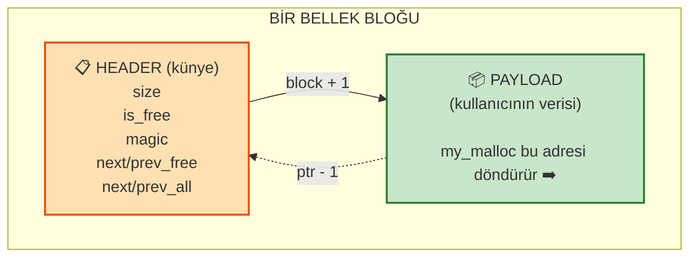
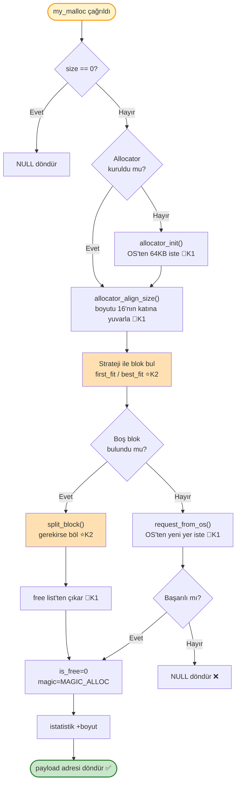
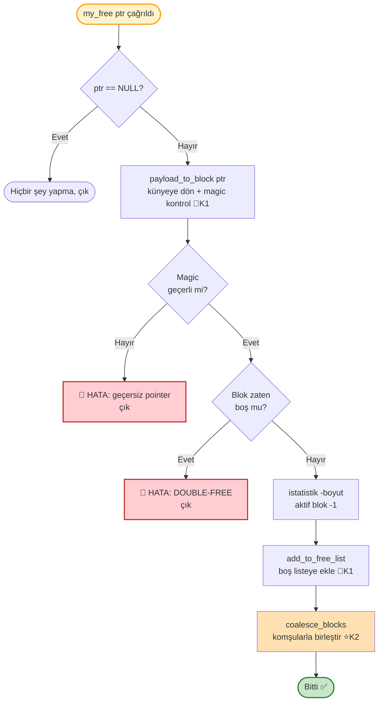
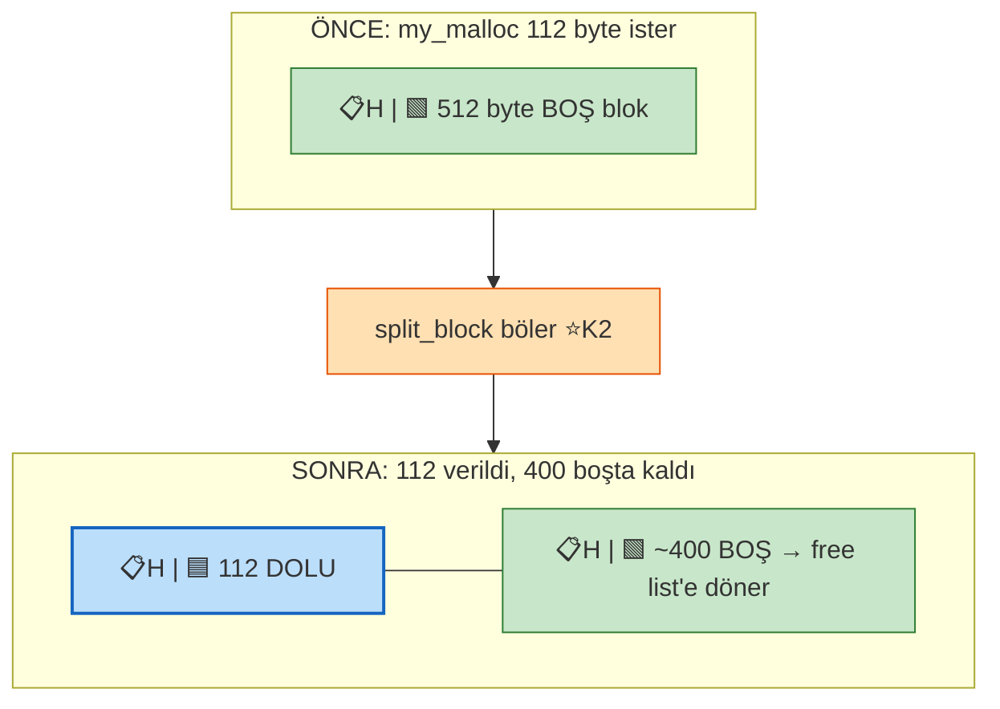
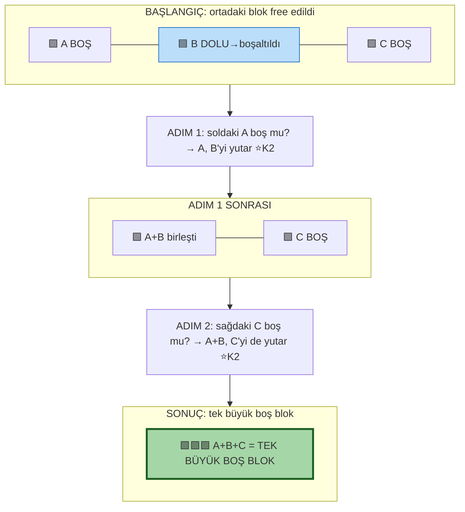
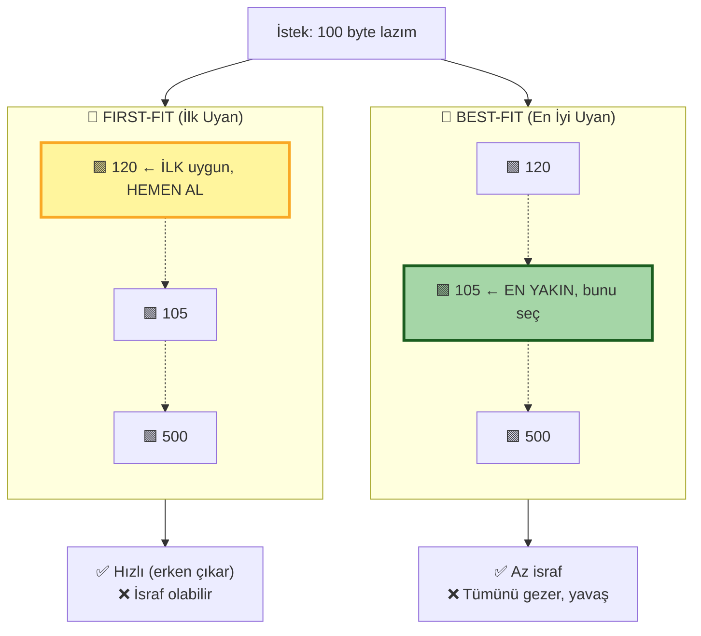
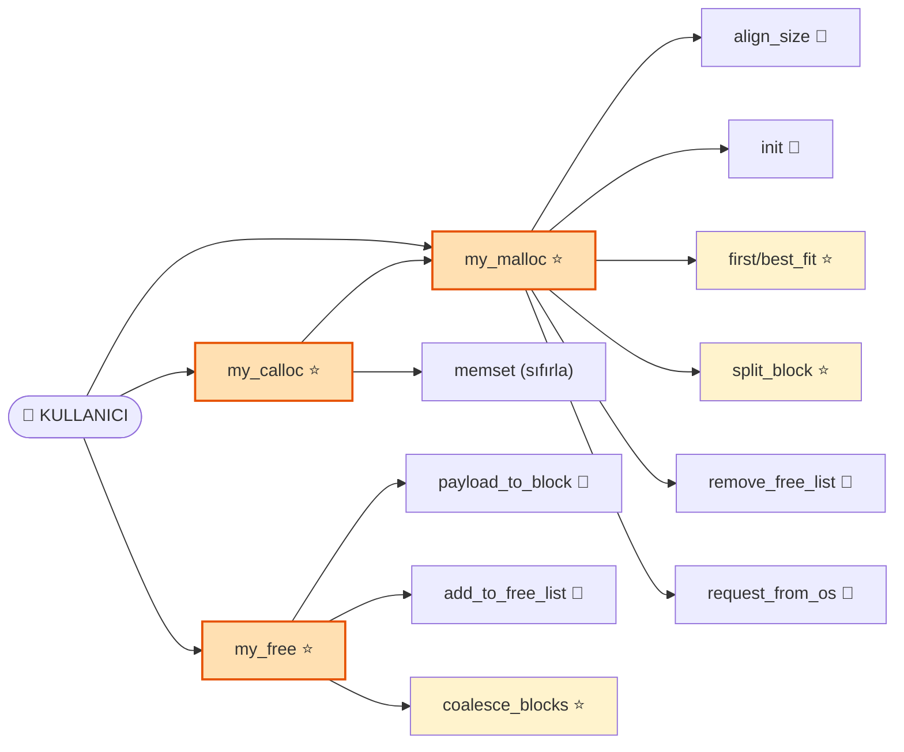
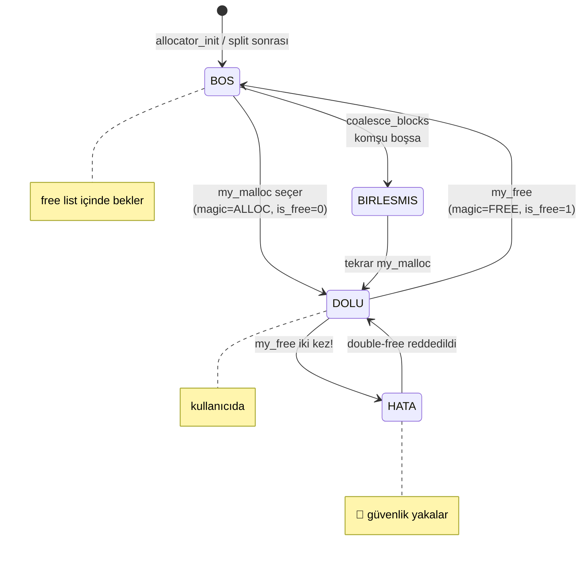
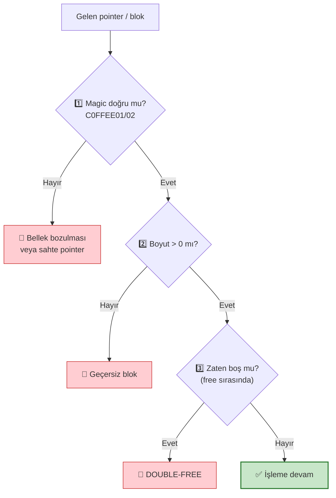

# Kişi 2 — Sunum Diyagramları (Mermaid)

> Bu dosyadaki diyagramlar **GitHub**, **VS Code (Markdown Preview)** ve <https://mermaid.live> üzerinde otomatik çizilir.
> Sunumda kullanmak için: diyagrama sağ tık → "Resmi farklı kaydet" veya mermaid.live'da PNG/SVG export.

---

## 1. Bellek Düzeni — Bir Blok Nasıl Görünür?

> 🔑 **Magic Number:** `0xC0FFEE01` = DOLU blok · `0xC0FFEE02` = BOŞ blok
> Künye bozulursa magic yanlış olur → allocator hemen yakalar.

---

## 2. `my_malloc()` Akış Şeması

---

## 3. `my_free()` Akış Şeması — Güvenlik Kapıları

---

## 4. Block Splitting (Bölme) — Önce / Sonra

> 💡 Amaç: **internal fragmentation** (iç israf) azaltmak. Kalan parça çok küçükse bölme yapılmaz.

---

## 5. Block Coalescing (Birleştirme) — 2 Adım

> 💡 Amaç: **external fragmentation** (dış israf) azaltmak. Neden 2 adım? Sol birleşince merkez blok değişir, sağ kontrol yeni merkez üzerinden yapılır.

---

## 6. First-Fit vs Best-Fit Karşılaştırma

---

## 7. Fonksiyon Çağrı Grafiği — Kim Kimi Çağırır?

> ⭐ = Kişi 2 yazdı · 🔵 = Kişi 1 yazdı

---

## 8. Bir Bloğun Yaşam Döngüsü (State Diagram)

---

## 9. Güvenlik Katmanları (Kişi 2)

